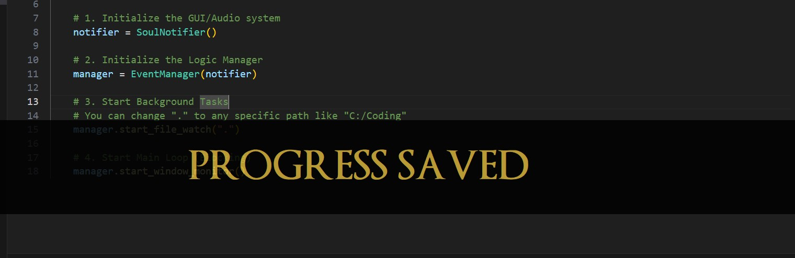

# Dark Souls Notification - Python



A background Python script that brings the iconic Dark Souls notification banners to your Windows desktop. It listens to system events—like saving a file, switching windows, or encountering a code error—and triggers a "BONFIRE LIT" style popup with sound.

## Features
* **Progress Saved:** Triggers when you save a file (Ctrl+S).
* **Area Discovered:** Triggers when you switch active windows.
* **Humanity Restored:** Triggers when you switch specifically to a coding IDE.
* **You Died:** Triggers when you copy an error message (e.g., "Traceback", "Error") to your clipboard.
* **Non-Intrusive:** Notifications are click-through and fade in/out smoothly without stealing focus.

## Setup

1.  Clone the repository.
2.  Install dependencies:
    ```bash
    pip install -r requirements.txt
    ```
3.  Navigate to the source folder and run the script:
    ```bash
    cd src
    python main.py
    ```

## Contributing
I am looking for more creative triggers! If you have ideas for system events to track (e.g., battery low, specific time of day, git push), please contribute.

* **`src/options.py`**: Adjust probabilities, colors, and text.
* **`src/triggers.py`**: Add your own logic to the `EventManager` class.

## Project Structure
```text
/
├── README.md
├── sources/
│   └── example.png
└── src/
    ├── assets/
    │   ├── OptimusPrinceps.ttf
    │   └── new_area.mp3
    ├── main.py
    ├── notifier.py
    ├── options.py
    └── triggers.py

```


### Summary of Fixes:
1.  **Dependencies:** Added `pyperclip` to the install command (crucial for the "You Died" trigger).
2.  **Run Command:** Changed to `cd src` then `python main.py` so it finds the files correctly.
3.  **File Paths:** Added a "Project Structure" section so contributors know exactly where `assets` and `src` files should live.
